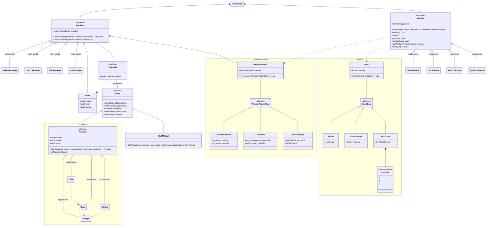

```mermaid
---
config:
  class:
    hideEmptyMembersBox: true
---
classDiagram
    Renderer <|-- VulkanRenderer: implements
    Renderer <|-- D3D12Renderer: implements
    Renderer <|-- SDLRenderer: implements
    Renderer <|-- SoftRenderer: implements
    class Renderer {
        <<interface>>
        -vector~Drawable &~ drawList
        +Renderer(WindowPointer &window, ivec2 size) Renderer
        +updateDrawList(vector~Drawable &~ drawList)
    }

    Renderer o-- Vertex
    class Vertex {
        +vec3 position
        +vec4 color
        +vec3 normal
    }

    Renderer o-- Drawable
    Drawable ..> Vertex
    class Drawable {
        <<interface>>
        +pack() vector~Vertex~
    }

    Drawable <|-- Model: implements
    Model <|-- Primitive
    Model <|-- GLTFModel
    class Model {
        <<interface>>
        +translate(vec3 translation)
        +setPosition(vec3 position)
        +rotate(quat rotation)
        +setRotation(quat rotation)
        +setScale(vec3 scale)
    }

    Primitive <|-- Triangle: implements
    Primitive <|-- Cube: implements
    Primitive <|-- Quad: implements
    Primitive <|-- Sphere: implements
    Quad ..> Triangle
    Sphere ..> Triangle
    Cube ..> Quad
    namespace Primitives {
        class Primitive {
            <<abstract>>
            #quat rotation
            #vec3 positon
            #vec3 scale
            +Primitive(vec3 position, quat rotation, vec3 scale, vec4 color) Primitive*
            +setColor(vec4 color)*
        }
        class Triangle
        class Quad
        class Cube
        class Sphere
    }

    class GLTFModel {
        +GLTFModel(vec3 position, quat rotation, vec3 scale, path location) GLTFModel
    }

    EventData <|-- Resize
    EventData <|-- FocusChange
    EventData <|-- KeyPress
    Event o-- EventData
    KeyPress *-- KeyCode
    namespace Events {
        class KeyCode {
            <<enumeration>>
            A
            B
            C
            ...
        }

        class Resize {
            +ivec2 size
        }
        class FocusChange {
            +bool isFocused
        }
        class KeyPress {
            +KeyCode keycode
        }

        class EventData {
            <<abstract>>
        }

        class Event {
            +EventData data
            +is~T inherits EventData~() bool
        }
    }

    Window ..> WindowPointer
    Window ..> Event
    Window <|-- SFMLWindow: implements
    Window <|-- SDLWindow: implements
    Window <|-- Win32Window: implements
    Window <|-- WaylandWindow: implements
    class Window {
        <<interface>>
        +bool hdrSupported
        +Window(ivec2 size, string title, bool fullscreen, bool resizable)
        +isOpen() bool
        +close()
        +getSize() ivec2
        +setSize(ivec2 size)
        +getWindowPointer() WindowPointer
        +pollEvent() Event
    }

    WindowPointerData <|-- WaylandPointer
    WindowPointerData <|-- X11Pointer
    WindowPointerData <|-- Win32Pointer
    WindowPointer o-- WindowPointerData
    Renderer *-- WindowPointer
    namespace WindowPointers {
        class WaylandPointer {
            +wl_display* display
            +wl_surface* surface
        }
        class X11Pointer {
            +xcb_connection_t connection
            +xcb_window_t window
        }
        class Win32Pointer {
            +HINSTANCE hinstance
            +HWND hwnd
        }

        class WindowPointerData {
            <<abstract>>
        }

        class WindowPointer {
            +WindowPointerData data
            +is~T inherits WindowPointerData~() bool
        }
    }

    Application *-- Renderer
    Application *-- Window
    class Application {
    }
```